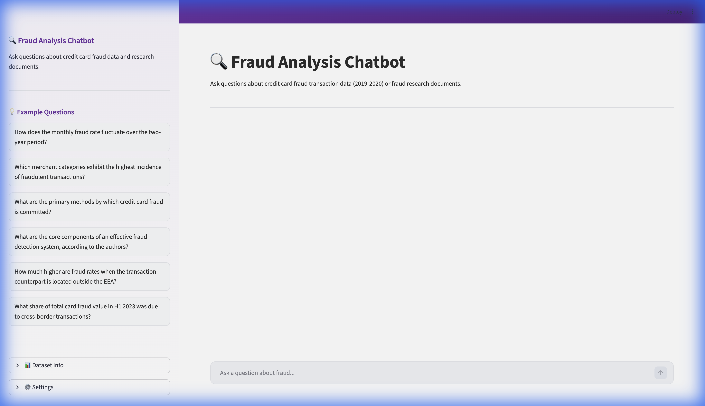
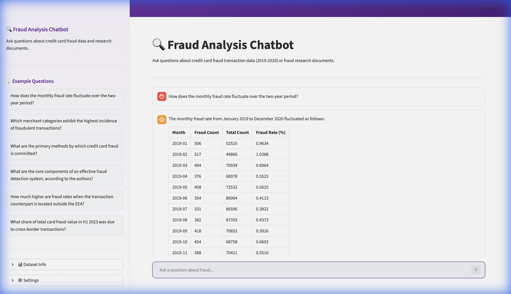
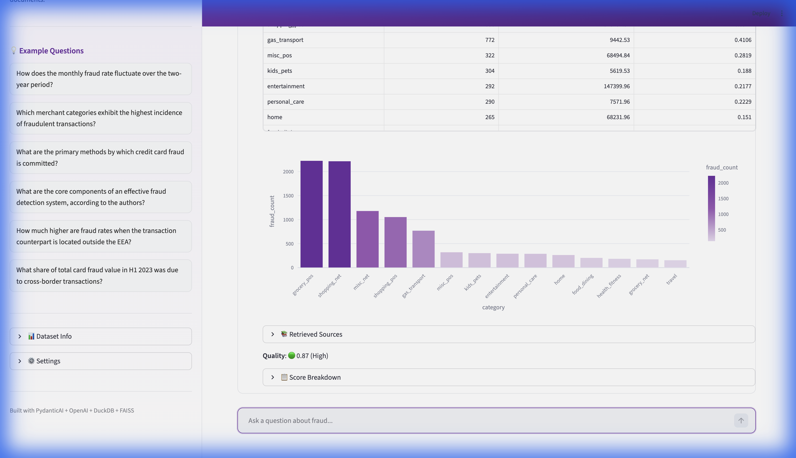
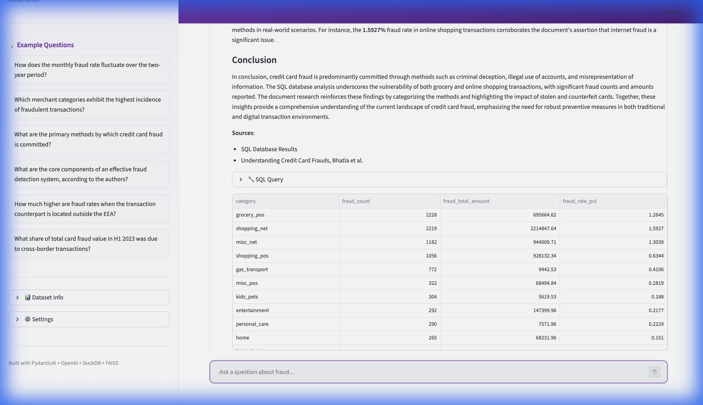
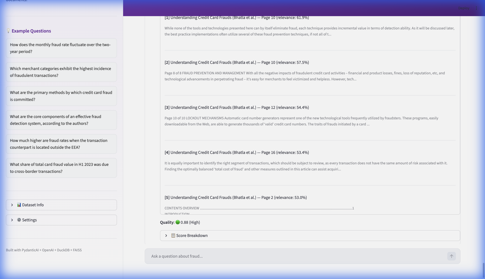
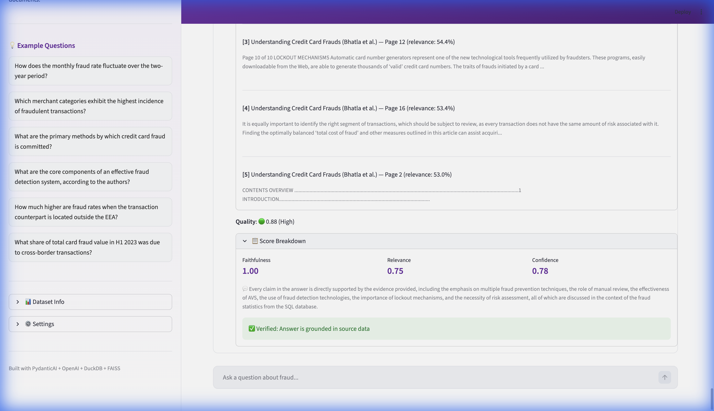

# 🔍 Fraud Q&A Agent Chatbot

> **Assessment**: An intelligent agent chatbot that extracts meaningful information from both a tabular fraud dataset and research documents, answering complex analytical questions with structured evidence and quality scoring.

## 🎬 Demo

**Full Walkthrough** - SQL queries with auto-charts, RAG answers with source citations, quality scoring:


**E2E Test** - SQL query (fraud rate) then RAG query (detection methods) tested end-to-end:


---

## Table of Contents

- [Overview](#overview)
- [Architecture](#architecture)
- [Tech Stack](#tech-stack)
- [Key Features](#key-features)
- [Assessment Questions & Answers](#assessment-questions--answers)
- [Quality Scoring Methodology](#quality-scoring-methodology)
- [Screenshots](#screenshots)
- [Project Structure](#project-structure)
- [Installation](#installation)
- [Testing](#testing)
- [Design Decisions](#design-decisions)
- [Known Limitations](#known-limitations)

---

## Overview

This project implements a **Q&A Agent Chatbot** that can answer questions by:

1. **Querying tabular data**: Converts natural language to SQL, executes against 1.85M fraud transactions stored in DuckDB, and auto-visualizes results with interactive Plotly charts.
2. **Searching research documents**: Uses FAISS vector search to retrieve relevant passages from two PDF papers, then generates cited answers via RAG (Retrieval-Augmented Generation).
3. **Hybrid mode**: When a question spans both data and documents, the agent uses both tools and synthesizes a unified answer.

Every response includes a **quality score** (faithfulness, relevance, confidence) and **answer validation** to ensure the answer is grounded in its source data.

### Data Sources

| Source | Description | Details |
|---|---|---|
| **Fraud Dataset** | [Kaggle Fraud Detection](https://www.kaggle.com/datasets/kartik2112/fraud-detection) | 1,852,394 transactions (Jan 2019 – Dec 2020), ~0.52% fraud rate |
| **Bhatla et al.** | "Understanding Credit Card Frauds" (2003) | 15 pages: fraud methods, prevention, detection techniques |
| **EBA/ECB 2024** | "Report on Payment Fraud" (Aug 2024) | 35 pages: EU/EEA fraud statistics, cross-border analysis |

---

## Architecture

```
┌──────────────────────────────────────────────────────────────────┐
│                        Streamlit UI                              │
│  Chat Panel  │  Results (table/chart)  │  Quality Score Badge    │
└──────┬───────┴──────────▲──────────────┴────────▲───────────────┘
       │                  │                       │
       ▼                  │                       │
┌──────────────────────────────────────────────────────────────────┐
│               FraudRouter (PydanticAI Agent)                     │
│          Classifies intent → dispatches to tool(s)               │
│                                                                  │
│  ┌─────────────────┐        ┌─────────────────┐                  │
│  │    SQLTool       │        │    RAGTool       │                  │
│  │ NL → SQL → exec │        │ Embed → search  │                  │
│  │ → format result  │        │ → generate + cite│                  │
│  └────────┬─────────┘        └────────┬─────────┘                  │
│           ▼                           ▼                          │
│  ┌─────────────────┐        ┌─────────────────┐                  │
│  │    DuckDB        │        │     FAISS        │                  │
│  │  1.85M rows      │        │  184 PDF chunks  │                  │
│  │  (CSV ingest)    │        │  + embeddings    │                  │
│  └──────────────────┘        └──────────────────┘                  │
│                                                                  │
│  ┌─────────────────────┐  ┌─────────────────────┐                │
│  │  ResultSynthesizer  │  │    QualityScorer     │                │
│  │  (hybrid answers)   │  │ + AnswerValidator    │                │
│  └─────────────────────┘  └─────────────────────┘                │
└──────────────────────────────────────────────────────────────────┘
```

**Data Flow:**
1. User enters a question via the Streamlit chat interface
2. `FraudRouter` (PydanticAI Agent) classifies intent and routes to `SQLTool`, `RAGTool`, or both
3. Tools execute queries and return structured results
4. If both tools are used, `ResultSynthesizer` merges them into a unified answer
5. `QualityScorer` evaluates the answer (faithfulness, relevance, confidence)
6. `AnswerValidator` verifies the answer is grounded in source data
7. Results are rendered with expandable SQL queries, source citations, charts, and quality badges

---

## Tech Stack

| Component | Choice | Rationale |
|---|---|---|
| **Language** | Python 3.11+ | Required by assessment |
| **Agent Framework** | PydanticAI | Type-safe tool registration, dependency injection, structured output |
| **LLM** | OpenAI GPT-4o-mini | Cost-effective (~$0.001/query), excellent at Text-to-SQL and RAG |
| **Embeddings** | text-embedding-3-small | 1536 dimensions, high quality for semantic search |
| **Vector Store** | FAISS (faiss-cpu) | Fast cosine similarity search, no server needed |
| **SQL Database** | DuckDB | Blazing fast analytical queries, native CSV support |
| **PDF Parsing** | PyMuPDF (fitz) | Fast, accurate text extraction with page metadata |
| **UI** | Streamlit | Built-in chat components, interactive data display |
| **Charts** | Plotly | Interactive line/bar charts with Mekari purple accents |

---

## Key Features

### 🤖 Intelligent Query Routing
The PydanticAI agent automatically determines whether to use SQL (data questions), RAG (document questions), or **both** for hybrid queries that span data and documents.

### 📊 Auto-Visualization
- Time-series data → interactive **Plotly line charts**
- Categorical data → interactive **Plotly bar charts**
- All SQL results shown in sortable data tables

### 🔒 Safety & Error Handling
- **SQL injection prevention**: SELECT-only queries, blocked keywords (DROP, DELETE, INSERT, UPDATE)
- **PII masking**: Credit card numbers, names, addresses masked in output
- **Self-correcting SQL**: On query error, feeds error back to LLM for auto-correction (1 retry)
- **Input validation**: Min/max question length, empty input handling
- **Graceful failures**: All external API calls wrapped with exponential-backoff retry

### 📄 Source Citations
RAG answers include expandable sections showing the exact document chunks retrieved, with page numbers and relevance scores (e.g., "Bhatla et al. - Page 5, 66.1% relevance").

### 🔄 Streaming
Real-time token streaming for a responsive chat experience.

### 🧹 Clean Architecture
- **Class-based design** throughout (no loose functions)
- **Strategy pattern** for chunking (fixed vs. semantic) and confidence scoring
- **Domain-grouped Pydantic models** for type safety
- **Centralized configuration** via `src/core/config.py`

---

## Assessment Questions & Answers

The chatbot correctly handles all 6 assessment questions:

| # | Question | Routing | Key Answer |
|---|---|---|---|
| 1 | "How does the monthly fraud rate fluctuate over the two-year period?" | **SQL** | Monthly rates from Jan 2019 to Dec 2020 with line chart |
| 2 | "Which merchant categories exhibit the highest incidence of fraudulent transactions?" | **SQL** | Category ranking (grocery_pos, shopping_net lead) with bar chart |
| 3 | "What are the primary methods by which credit card fraud is committed?" | **RAG** (Bhatla) | Lost/stolen 48%, Identity theft 15%, Skimming 14%, Counterfeit 12% |
| 4 | "What are the core components of an effective fraud detection system?" | **RAG** (Bhatla) | Manual review, AVS, CVM, lockout mechanisms, neural networks, biometrics |
| 5 | "How much higher are fraud rates outside the EEA?" | **RAG** (EBA/ECB) | ~10x higher for SCA-authenticated card payments |
| 6 | "What share of total card fraud in H1 2023 was due to cross-border?" | **RAG** (EBA/ECB) | 71% in value terms, 28% specifically outside EEA |

---

## Quality Scoring Methodology

Every response is scored on **three dimensions**, computed as a weighted sum:

| Dimension | Weight | Method | Description |
|---|---|---|---|
| **Faithfulness** | 50% | LLM-as-judge | Is the answer supported by the evidence? GPT-4o-mini evaluates and returns a score + reason |
| **Relevance** | 30% | Cosine similarity | Embedding similarity between question and answer using text-embedding-3-small |
| **Confidence** | 20% | Source-specific | **SQL**: 1.0 if query succeeds with rows, 0.5 if empty, 0.0 if failed. **RAG**: average of top-k FAISS similarity scores |

**Overall** = `0.5 × faithfulness + 0.3 × relevance + 0.2 × confidence`

**Answer Validation** (separate from scoring):
- **SQL Validator**: Checks that numbers cited in the answer exist in the query results
- **RAG Validator**: Checks that factual claims are supported by retrieved document chunks

Display: Green badge (>0.7), Yellow badge (0.4–0.7), Red badge (<0.4), with expandable breakdown showing each dimension and the faithfulness reason.

---

## Screenshots

### App Overview


### SQL Query - Monthly Fraud Trends (Data Table)


### SQL Query - Category Breakdown with Bar Chart


### RAG Query - Fraud Methods with Source Citations


### RAG - Retrieved Sources with Relevance Scores


### Quality Score Breakdown with Validation


---

## Project Structure

```
├── app.py                         # Streamlit entry point
├── requirements.txt               # Python dependencies
├── .env.example                   # API key template
├── pytest.ini                     # Test configuration
│
├── scripts/
│   └── ingest.py                  # One-time: CSV → DuckDB, PDF → FAISS
│
├── src/
│   ├── core/
│   │   ├── config.py              # Centralized configuration constants
│   │   └── llm_client.py          # OpenAI wrapper with retry logic
│   │
│   ├── agent/
│   │   ├── router.py              # PydanticAI agent + tool routing
│   │   ├── sql_tool.py            # Text-to-SQL pipeline (NL → SQL → execute)
│   │   ├── rag_tool.py            # RAG pipeline (embed → search → generate)
│   │   ├── synthesis.py           # Multi-tool result synthesizer
│   │   └── prompts.py             # All centralized system prompts
│   │
│   ├── data/
│   │   ├── database.py            # DuckDB: CSV ingest, schema, query execution
│   │   ├── vectorstore.py         # FAISS: PDF → chunks → embeddings → search
│   │   ├── pdf_helpers.py         # PDF text extraction utilities
│   │   └── strategies/            # Chunking strategies (fixed, semantic)
│   │
│   ├── models/                    # Pydantic models (domain-grouped)
│   │   ├── agent.py               # AgentDeps, AgentResponse
│   │   ├── tools.py               # SQLToolResult, RAGToolResult, QueryResult
│   │   ├── scoring.py             # QualityScore, ConfidenceContext
│   │   ├── chunks.py              # ChunkMetadata, SearchResult
│   │   └── source_type.py         # SourceType enum (SQL, RAG, BOTH, ERROR)
│   │
│   ├── scoring/
│   │   ├── quality.py             # QualityScorer (faithfulness, relevance, confidence)
│   │   ├── validation.py          # AnswerValidator (SQL + RAG grounding checks)
│   │   └── strategies/            # Confidence strategies (SQL, RAG, combined)
│   │
│   └── ui/
│       ├── chat.py                # Chat rendering, chart auto-detection
│       ├── sidebar.py             # Example questions, settings, dataset info
│       └── theme.py               # Mekari purple theme CSS
│
├── tests/
│   ├── test_sql_tool.py           # SQL tool tests (11 tests)
│   ├── test_rag_tool.py           # RAG tool tests (8 tests)
│   └── test_quality.py            # Quality scoring tests (11 tests)
│
├── docs/
│   ├── screenshots/               # App screenshots
│   ├── demo_walkthrough.webp      # Full demo recording
│   └── demo_e2e_sql_rag.webp      # E2E test recording
│
└── data/
    ├── raw/                       # CSV + PDF source files
    └── processed/                 # DuckDB file, FAISS index, chunks pickle
```

---

## Installation

For detailed step-by-step installation instructions, see **[INSTALLATION.md](INSTALLATION.md)**.

**Quick start:**

```bash
git clone <repo-url> && cd aiengineer-assesment
python -m venv .venv && source .venv/bin/activate
pip install -r requirements.txt
cp .env.example .env  # Set your OPENAI_API_KEY
# Place CSV + PDF files in data/raw/
python scripts/ingest.py
streamlit run app.py
```

---

## Testing

```bash
# Run all 30 tests
pytest tests/ -v
```

| Test Suite | Tests | Coverage |
|---|---|---|
| `test_sql_tool.py` | 11 | SQL validation, execution, PII masking, E2E queries |
| `test_rag_tool.py` | 8 | Vector search, source filtering, E2E RAG answers |
| `test_quality.py` | 11 | Confidence strategies, faithfulness, relevance, validation |

---

## Cost Estimate

| Component | Model | Cost/Query |
|---|---|---|
| SQL generation | GPT-4o-mini | ~$0.0004 |
| RAG answer | GPT-4o-mini | ~$0.0007 |
| Quality scoring | GPT-4o-mini | ~$0.0003 |
| Embedding (query) | text-embedding-3-small | ~$0.000002 |
| **Total per question** | | **~$0.001–0.002** |
| **Ingestion (one-time)** | text-embedding-3-small | **~$0.003** |

---

## Known Limitations

- Dataset is simulated (not real fraud data)
- Single LLM provider (OpenAI), no built-in fallback
- FAISS index is in-memory (fine for ~184 chunks, would need IVF for larger corpora)
- No persistent conversation memory across browser sessions (stateless per Streamlit session)
- Quality scoring adds ~1-2s latency per response (embedding + LLM-as-judge calls)
